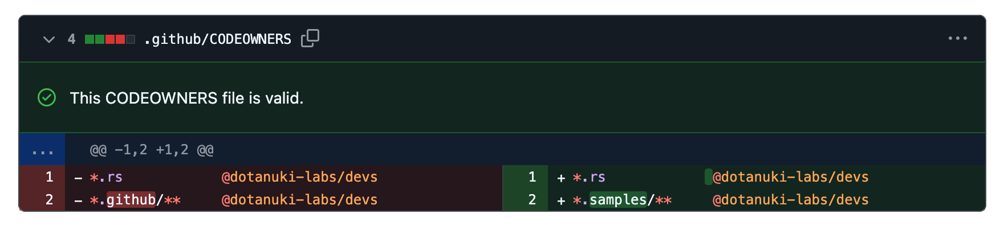

# canopus

> A fast and pragmatic validator for Github Codeowners

`canopus` is a small, fast and standalone CLI tool for validating
[Github Codeowners](https://docs.github.com/en/repositories/managing-your-repositorys-settings-and-features/customizing-your-repository/about-code-owners)
written in pure Rust. It should be fast enough to be configured as a
[Git hook](https://git-scm.com/book/en/v2/Customizing-Git-Git-Hooks)
in offline mode, and eventually also in online mode.

Hopefully `canopus` will spot errors not handle by Github, for instance
validating dangling glob patterns (the ones won't match any project path).
For instance, this is the Pull Request preview for a `CODEOWNERS` change
for this project, which should be an error since there is no `.samples` 
path around:

In addition to that, and unlike other competing tools, `canopus` brings 
configuration options to encourage good practices on code ownership, especially on 
large multimodular projects or monorepos.
